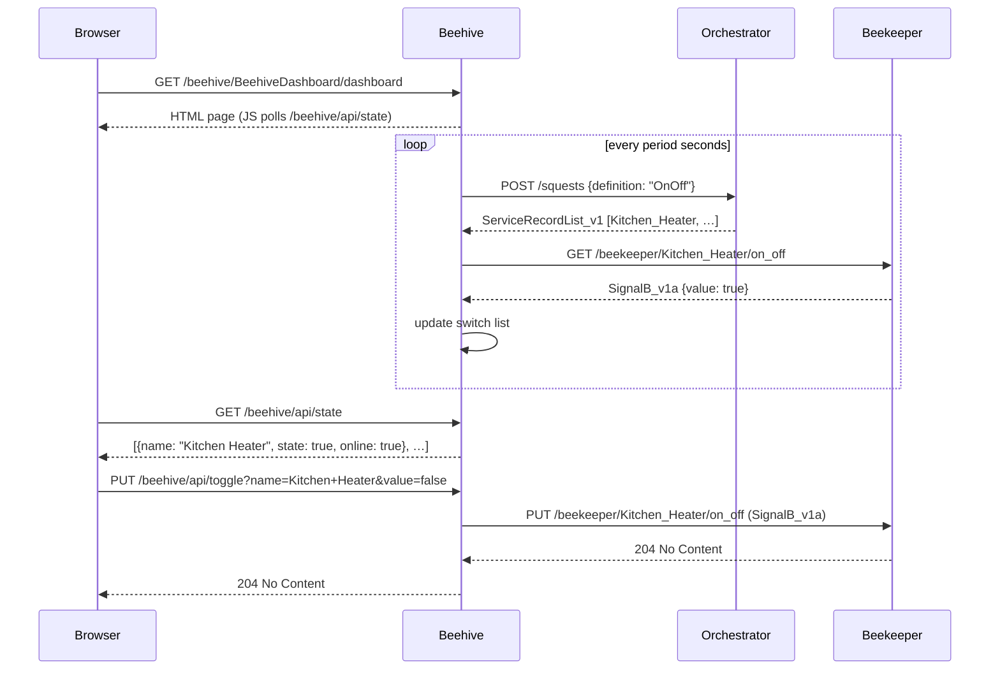

# mbaigo System: Beehive

Beehive is a web dashboard for the Arrowhead local cloud. It queries the **Orchestrator** for every registered `OnOff` service, reads the current state of each one, and presents them as toggle switches on an HTML page. Flipping a switch sends the command back through the local cloud to the device — no direct connection to deCONZ or any other gateway is required.

Beehive is intentionally thin: it holds no device-specific configuration and adapts automatically to whatever services are registered at any given time.

---

## How it works

```
Browser → GET /beehive/BeehiveDashboard/dashboard
            ↓ HTML + JS served

Browser → GET /beehive/api/state          (every 10 s)
            ↓ Beehive reads its in-memory switch list
            ← JSON [{name, state, online}, …]

Browser → PUT /beehive/api/toggle?name=Kitchen+Heater&value=true
            ↓ Beehive looks up the on_off service URL
            ↓ PUT SignalB_v1a → beekeeper/Kitchen_Heater/on_off
            ← 204 No Content
```

In the background, beehive periodically re-queries the Orchestrator and refreshes the switch states. This means newly paired devices appear automatically without a restart.

---

## Sequence diagram



---

## Dashboard

Open a browser at:

```
http://<beehive-host>:20186/beehive/BeehiveDashboard/dashboard
```

Each device with an `OnOff` service appears as a card with its name and a toggle switch. The page refreshes state every 10 seconds. Devices that could not be reached are shown faded with an "offline" label.

---

## Services

| Arrowhead service | Path | Method | Description |
|---|---|---|---|
| `Dashboard` | `/beehive/BeehiveDashboard/dashboard` | GET | HTML dashboard page |

Two additional HTTP endpoints are used internally by the dashboard JavaScript and are not registered as Arrowhead services:

| Path | Method | Description |
|---|---|---|
| `/beehive/api/state` | GET | JSON array of `{name, url, state, online}` for all discovered switches |
| `/beehive/api/toggle` | PUT | Query params `name` and `value` — proxies the toggle command to the target service |

---

## Configuration

Edit `systemconfig.json`:

| Field | Description |
|---|---|
| `ipAddresses` | IP addresses of the machine running beehive |
| `protocolsNports` → `http` | Port beehive listens on (default: 20186) |
| `coreSystems` → `orchestrator` | URL of the Arrowhead Orchestrator |
| `unit_assets[0].traits[0].period` | How often (seconds) to re-discover services and refresh switch states (default: 10) |

Example:

```json
{
    "systemname": "beehive",
    "ipAddresses": ["192.168.1.105", "127.0.0.1"],
    "unit_assets": [
        {
            "name": "BeehiveDashboard",
            "mission": "web_dashboard",
            "details": {},
            "services": [
                {
                    "definition": "Dashboard",
                    "subpath": "dashboard",
                    "details": { "Forms": ["text/html"] },
                    "registrationPeriod": 30,
                    "costUnit": ""
                }
            ],
            "traits": [{ "period": 10 }]
        }
    ],
    "protocolsNports": { "coap": 0, "http": 20186, "https": 0 },
    "coreSystems": [
        { "coreSystem": "serviceregistrar", "url": "http://192.168.1.108:20102/serviceregistrar/registry" },
        { "coreSystem": "orchestrator",     "url": "http://192.168.1.108:20103/orchestrator/orchestration" },
        { "coreSystem": "ca",               "url": "http://192.168.1.108:20100/ca/certification" },
        { "coreSystem": "maitreD",          "url": "http://localhost:20101/maitreD/maitreD" }
    ]
}
```

---

## Dependencies

Beehive depends only on `github.com/sdoque/mbaigo`. No external packages are required.

The dashboard page itself uses plain HTML, CSS, and JavaScript with no external libraries or CDN dependencies.

---

## Compiling

```bash
go build -o beehive
```

Cross-compile for Raspberry Pi 4/5 (64-bit):

```bash
GOOS=linux GOARCH=arm64 go build -o beehive_rpi64
```

Run from its own directory — the system reads `systemconfig.json` locally.

---

## Troubleshooting

### No devices appear on the dashboard

Beehive discovers devices by querying the Orchestrator for the `OnOff` service definition. If the dashboard shows "No OnOff services found in the local cloud", check:

1. **Beekeeper is running** and has successfully registered its services with the Service Registrar.
2. **The Orchestrator URL** in `systemconfig.json` is correct and reachable.
3. The Orchestrator has an authorisation rule permitting `beehive` to consume `OnOff` from `beekeeper`.

You can verify that beekeeper has registered its services by querying the Service Registrar directly:

```bash
curl -s http://<registrar-ip>:20102/serviceregistrar/registry | python3 -m json.tool | grep -i onoff
```

### A device shows "offline"

The switch card is faded and labelled "offline" when beehive received an HTTP error or timeout when reading the device's `on_off` service. This usually means:

- Beekeeper is running but the specific device has not yet reported a measurement (returns `503`). Wait a few minutes after first pairing.
- The device URL stored by the Orchestrator points to a stale IP or port.

### Toggling a switch has no effect

If the dashboard shows 200 but the physical device does not respond, the problem is likely in beekeeper — check that beekeeper's `serving` function accepted the `PUT` and that deCONZ acknowledged the command in beekeeper's log output.
