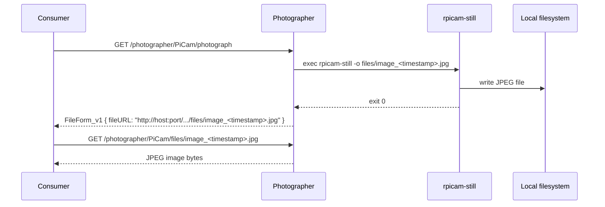

# mbaigo System: Photographer

The Photographer system exposes a Raspberry Pi camera as an Arrowhead service. A consumer system sends a GET request to the `photograph` service; Photographer triggers `rpicam-still` to capture a frame, saves the JPEG to a local `files/` directory, and returns the image URL in a `FileForm_v1` response. The consumer can then fetch the file directly from that URL.

---

## How it works



---

## Services

| Service | Path | Method | Response | Description |
|---|---|---|---|---|
| `photograph` | `/photographer/<asset>/photograph` | GET | `FileForm_v1` | Triggers a capture and returns the URL of the saved JPEG |
| `files` | `/photographer/<asset>/files/<filename>` | GET | JPEG | Serves a previously captured image file |

---

## Hardware requirements

- Raspberry Pi (any model with a CSI camera connector)
- Raspberry Pi Camera Module (V1 IMX219, V2 IMX219, HQ IMX477, or Camera Module 3 IMX708)
- Raspberry Pi OS **Bookworm** or later (uses `rpicam-still` from the libcamera stack)

> **One process at a time.** libcamera allows only one process to access the camera simultaneously. If `rpicam-still` is already running (e.g. launched by the Photographer service), any concurrent `rpicam-still` call from the terminal will fail with `no cameras available`. Wait for the current capture to finish before testing from the command line.

---

## Verifying the camera

Check camera detection and a test capture before running the system:

```bash
# List cameras detected by libcamera
rpicam-hello --list-cameras

# Take a test shot
rpicam-still -o test.jpg
```

> **Note:** `vcgencmd get_camera` always reports `supported=0 detected=0` on Bookworm — this queries the legacy firmware interface which is permanently disabled. It does not reflect libcamera's view of the camera.

If `rpicam-still` reports `no cameras available`, check:
1. The ribbon cable is firmly seated at both ends (contacts face the board on the Pi side).
2. `camera_auto_detect=1` is present in `/boot/firmware/config.txt`.
3. No other process is currently holding the camera open (`ps aux | grep rpicam`).

---

## Configuration

Edit `systemconfig.json` to match your setup:

| Field | Description |
|---|---|
| `ipAddresses` | IP addresses of the Raspberry Pi |
| `protocolsNports` → `http` | Port the system listens on (default: 20160) |
| `unit_assets[0].name` | Asset name, also used as part of the service URL |
| `unit_assets[0].details` → `FunctionalLocation` | Where the camera is installed (e.g. `Entrance`) |
| `unit_assets[0].details` → `Model` | Camera module model for documentation |
| `coreSystems` | URLs of the Service Registrar, Orchestrator, CA, and maitreD |

---

## Compiling

Build for the current machine:

```bash
go build -o photographer
```

Cross-compile for Raspberry Pi 4/5 (64-bit):

```bash
GOOS=linux GOARCH=arm64 go build -o photographer_rpi64
```

Copy to the Raspberry Pi:

```bash
scp photographer_rpi64 jan@192.168.1.x:rpiExec/photographer/
```

Run from the system's own directory — it reads `systemconfig.json` from the working directory. On first run without a config file, it generates one and exits so you can fill in the correct values.

```bash
cd ~/rpiExec/photographer
./photographer_rpi64
```
