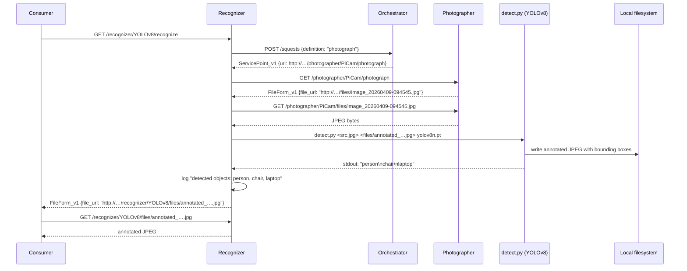

# mbaigo System: Recognizer

The Recognizer system performs object detection on images captured by a Raspberry Pi camera. It consumes the `photograph` service from the Arrowhead local cloud, downloads the JPEG, passes it to **YOLOv8** via a Python helper script, and returns the URL of the annotated image (with bounding boxes drawn around every detected object). Detected object names are printed to the terminal log.

The system requires no direct knowledge of the camera hardware — it locates a photographer via the Orchestrator. If more than one camera is registered (e.g. entrance and parking lot), the `functionalLocation` trait filters the search to a specific one.

---

## How it works



---

## Services

| Service | Path | Method | Response | Description |
|---|---|---|---|---|
| `recognize` | `/recognizer/<asset>/recognize` | GET | `FileForm_v1` | Triggers capture + detection; returns URL of annotated image |
| *(files)* | `/recognizer/<asset>/files/<filename>` | GET | JPEG | Serves a previously annotated image file |

---

## Configuration

Edit `systemconfig.json` to match your setup:

| Field | Description |
|---|---|
| `ipAddresses` | IP addresses of the machine running the Recognizer |
| `protocolsNports` → `http` | Port the system listens on (default: 20164) |
| `unit_assets[0].traits[0].functionalLocation` | Filter the photograph service by location (e.g. `"Entrance"`). Leave empty to use the first available camera. |
| `unit_assets[0].traits[0].yoloModel` | YOLO model to use (default: `yolov8n.pt`). Downloaded automatically by Ultralytics on first run. |
| `unit_assets[0].traits[0].pythonCmd` | Python interpreter (default: `python3`). Change to an absolute path or virtual-environment path if needed. |
| `unit_assets[0].traits[0].detectScript` | Path to the detection script (default: `detect.py`). Useful when the binary and script are in different directories. |
| `coreSystems` | URLs of the Service Registrar, Orchestrator, CA, and maitreD |

### Available YOLO models

| Model | Size | Speed | Accuracy | Good for |
|---|---|---|---|---|
| `yolov8n.pt` | 6 MB | fastest | lowest | Raspberry Pi, real-time |
| `yolov8s.pt` | 22 MB | fast | medium | Pi 4/5 with acceptable latency |
| `yolov8m.pt` | 50 MB | moderate | good | desktop / Pi 5 |
| `yolov8l.pt` | 83 MB | slow | better | GPU-equipped machine |
| `yolov8x.pt` | 131 MB | slowest | best | GPU-equipped machine |

On a Raspberry Pi 4 or 5, `yolov8n.pt` is the practical choice.

---

## Installing YOLOv8 on Raspberry Pi

### Requirements

- Raspberry Pi 4 or 5 (64-bit OS strongly recommended)
- Raspberry Pi OS Bookworm 64-bit
- Python 3.9 or later
- At least 2 GB free disk space (model weights + dependencies)

### Step 1 — Update the system

```bash
sudo apt update && sudo apt upgrade -y
```

### Step 2 — Install system dependencies

```bash
sudo apt install -y python3-pip python3-venv libopenblas-dev libatlas-base-dev
```

### Step 3 — Create a virtual environment

Running Ultralytics inside a virtual environment avoids conflicts with system Python packages (required on Bookworm, which enforces PEP 668):

```bash
python3 -m venv ~/yolo-env
source ~/yolo-env/bin/activate
```

To activate the environment automatically whenever you work with the recognizer, add the `source` line to your shell profile, or set `pythonCmd` in `systemconfig.json` to the full path:

```json
"pythonCmd": "/home/jan/yolo-env/bin/python3"
```

### Step 4 — Install Ultralytics

```bash
pip install ultralytics
```

This installs PyTorch, OpenCV, and all other required libraries. On a Raspberry Pi the download may take several minutes.

### Step 5 — Verify the installation

```bash
python3 -c "from ultralytics import YOLO; m = YOLO('yolov8n.pt'); print('OK')"
```

The first run downloads `yolov8n.pt` (~6 MB) from the Ultralytics CDN. Subsequent runs use the cached file from `~/.config/Ultralytics/`.

### Step 6 — Test detection manually

```bash
python3 detect.py test_input.jpg test_output.jpg yolov8n.pt
```

The script prints detected class names to stdout and writes the annotated image to `test_output.jpg`.

---

## Compiling

Build for the current machine:

```bash
go build -o recognizer
```

Cross-compile for Raspberry Pi 4/5 (64-bit):

```bash
GOOS=linux GOARCH=arm64 go build -o recognizer_rpi64
```

Copy binary and Python script to the Raspberry Pi:

```bash
scp recognizer_rpi64 detect.py jan@192.168.1.x:rpiExec/recognizer/
```

Run from the system's own directory:

```bash
cd ~/rpiExec/recognizer
./recognizer_rpi64
```

On first run without a `systemconfig.json`, the system generates one and exits so you can fill in the correct values.

---

## Troubleshooting

### `ultralytics not installed`

The Python virtual environment is not active, or `pythonCmd` points to the wrong interpreter. Set `pythonCmd` in `systemconfig.json` to the full path of the virtual environment's Python:

```bash
which python3   # inside the activated venv
# e.g. /home/jan/yolo-env/bin/python3
```

### `getting photograph: service discovery failed`

The Orchestrator cannot find a registered `photograph` service. Check that the Photographer system is running and that its services are registered. If `functionalLocation` is set, verify it matches exactly what the Photographer has in its asset `details`.

### Detection is very slow

On a Raspberry Pi 4, a single inference with `yolov8n.pt` takes roughly 1–3 seconds. Larger models (`yolov8s`, `yolov8m`) will be proportionally slower. The Pi 5 is roughly twice as fast as the Pi 4 for CPU inference. For real-time use, consider running the Recognizer on a more capable machine in the same local cloud.

### Annotated image is blank or not saved

Check that the `files/` directory is writable and that `detect.py` is present in the working directory alongside the binary.
